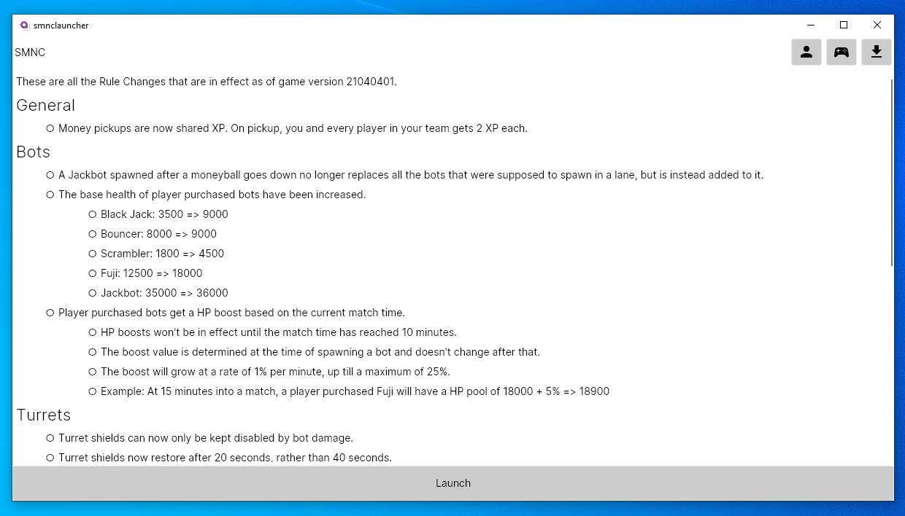
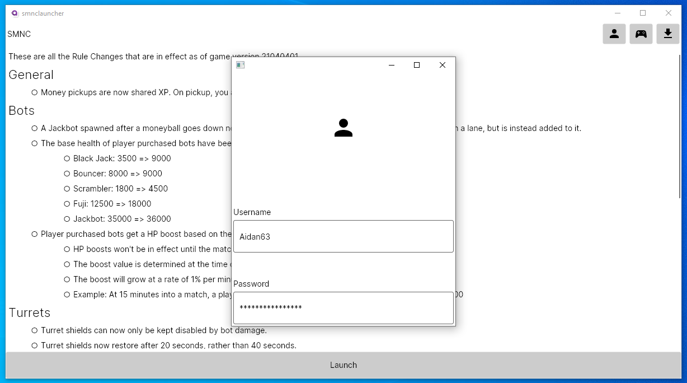
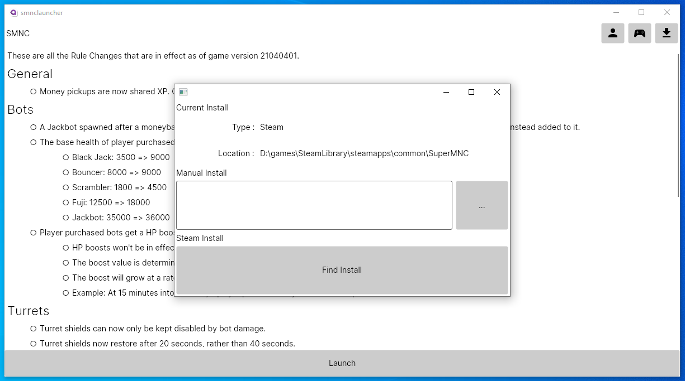
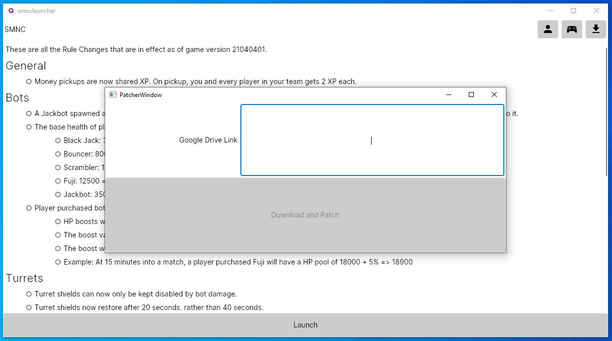

# SuperMNC Launcher

3rd party patcher and launcher for smnc-reboot.

## Features

- Download and apply patches from google drive links.
- Store and launch the game with your credentials for auto login.
- Supports steam and non-steam installs.
- Scrape and display the patch notes from the reboot-smnc website.

Account Management         |  Install Management       | Applying Patches
:-------------------------:|:-------------------------:|:-------------------------:
  |    |  

## Future Additions

- Track and detect what patches have been applied.
- Offer a list of known patches.
- Single click to patch to the latest known version.
- Install the game through steam.
- Mac and Linux support by automatically setting up a wine prefix.
